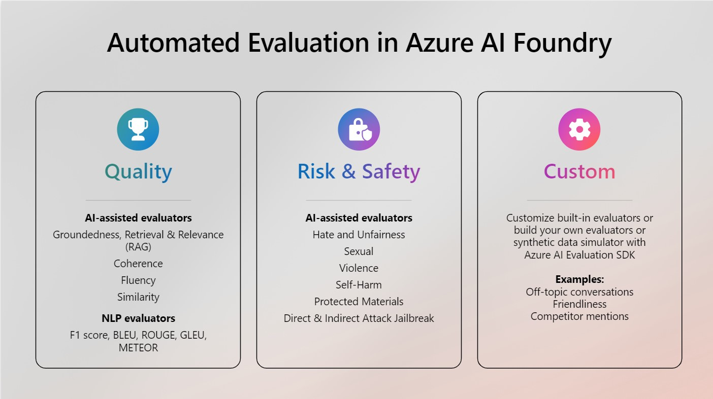

## Supported Evaluators

Azure AI Evaluation SDK supported a group of evaluators that measure different aspects of a response’s alignment with expectations.  They can be customized, versioned, and shared across an organization, ensuring consistent evaluation metrics and parameters across various projects.  The choice of evaluators will depend on the specific goals of the evaluation, such as assessing quality, safety, or custom requirements tailored to a particular use case. Below are three main categories of evaluators we support via Azure AI SDK and Studio UI: 

Currently, Azure AI Evaluation SDK supports three types of evaluators:  

* [Risk and safety evaluators](AI_Judge_Evaluators_Safety_Risks/): Evaluating potential risks associated with AI-generated content is essential for safeguarding against content risks with varying degrees of severity. This includes evaluating an AI system's predisposition towards generating harmful or inappropriate content. 

* Generation quality evaluators: This involves assessing metrics such as the groundedness, coherence and relevance of generated content using robust [AI-assisted](AI_Judge_Evaluators_Quality/) and [NLP](NLP_Evaluators/) metrics.

* [Custom evaluators](Custom_Evaluators/): Tailored evaluation metrics can be designed to meet specific needs and goals, providing flexibility and precision in assessing unique aspects of AI-generated content. These custom evaluators allow for more detailed and specific analyses, addressing particular concerns or requirements that standard metrics may not cover. 

You can run evaluators locally or [remotely](../Supported_Evaluation_Targets/Evaluate_On_Cloud/Evaluate_On_Cloud.ipynb), log results in the cloud using the evaluation SDK, or integrate them into automated evaluations within the Azure AI Studio UI. 
