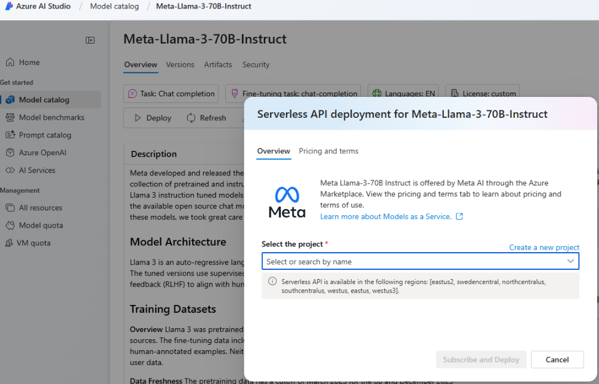
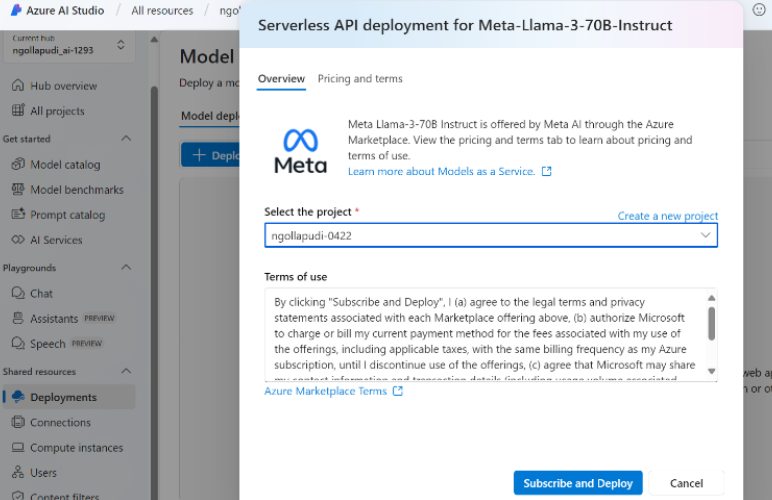

# Use Llama models with Agents 

You can now create agents using Llama 3 in Azure AI Agents Service. To get started: 
1. Go to ai.azure.com and select **Model catalog** in the left navigation menu, and scroll down to **Meta-Llama-3-70B-Instruct**. You can also use  this link.  

1. Select **Deploy**. 

1. In the Deployment options screen that appears, select Serverless API with Azure AI Content Safety. 

    
 
1. Select your project and click **Subscribe and deploy**. 

     

1. Add the Serverless connection to your hub / project. The deployment name you choose will be the one you reference in your code.  

1. When calling agent creation API, set the `models` parameter to your deployment name. For example:

    
    ```python
    agent = project_client.agents.create_agent( model="llama-3", name="my-agent", instructions="You are a helpful agent" ) 
    ```
