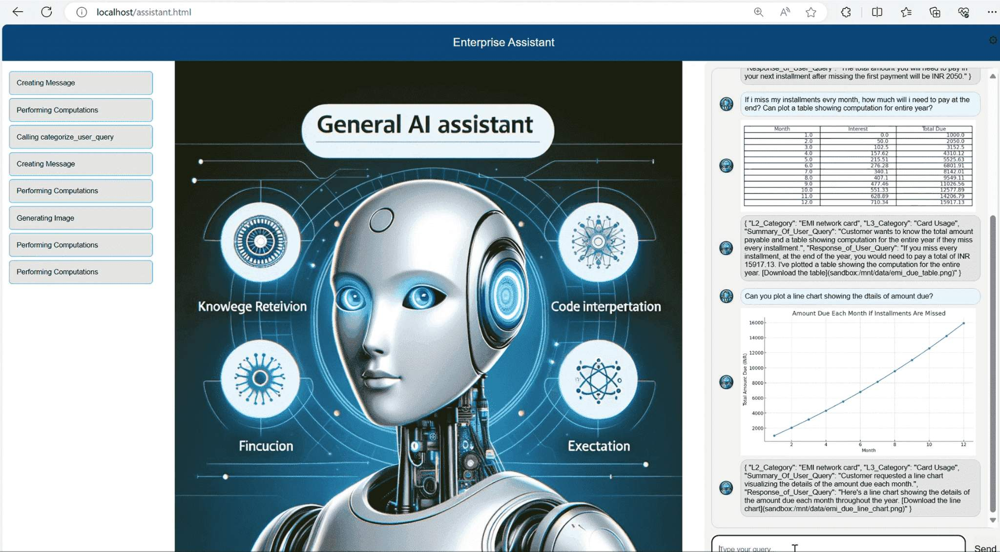

# Contoso Financial Assistant

## Description

This repository contains the backend and frontend code for the Contoso Financials Assistant. 
Contoso Financial Assistant caters to below types of queries:
- Contoso financial financial performance in year 2023
- Contoso financial product lines
- Late EMI related queries for paurchases made using Conto Premier Credit Card 

## Tools

- Code Interpreter
- Custom Function to Categorize User Query
- Data file for interest charged on late EMIs
- Data file for info on Contoso Finacial Product portfolio and financial performance

## Installation

1. Clone the repository.
2. Install the necessary dependencies for the backend using requirements.txt
3. Create a .env file in backend folder and specify values of following variables
      OPEN_AI_EMBEDDING_ENDPOINT=<your_open_ai_embedding_endpoint>
      OPEN_AI_EMBEDDING_KEY=<your_open_ai_embedding_key>
      OPEN_AI_EMBEDDING_DEPLOYMENT_NAME=<your_open_ai_embedding_deployment_name>
      
      OPEN_AI_ENDPOINT=<your_open_ai_endpoint>
      OPEN_AI_KEY=<your_open_ai_key>
      OPEN_AI_DEPLOYMENT_NAME=<your_open_ai_deployment_name>
      
      SEARCH_ENDPOINT=<your_search_endpoint>
      SEARCH_KEY=<your_search_key>
      SEARCH_INDEX_NAME=<your_search_index_name>
      
      BING_KEY=<your_bing_key>
      BING_ENDPOINT=<your_bing_endpoint>

## Usage

1. Create AI Search index for user query categorization by executing get_intent_init.py 
2. Start the backend server using command flask run --host 0.0.0.0 --port 5007
3. Launch the frontend application by opening `assistant.html` file in your browser.
4. Sample conversation:
Tell me about performance of contoso financials in 2023.
Or
I purchased a Washing Machine on EMI Card. 
My EMI is 1000 Rs for 12 months.  
I missed my last EMI. How much do i pay now?
