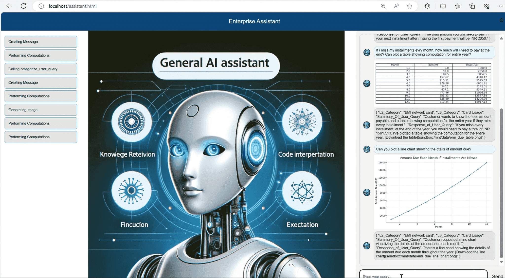

# Contoso Financial Assistant

## Description

This repository contains the backend and frontend code for the Contoso Financials Assistant. 
Contoso Financial Assistant caters to below types of queries:
- Contoso financial financial performance in year 2023
- Contoso financial product lines
- Late EMI related queries for paurchases made using Conto Premier Credit Card 

## Tools

- Code Interpreter
- Custom Function to Categorize User Query
- Data file for interest charged on late EMIs
- Data file for info on Contoso Finacial Product portfolio and financial performance

## Installation

1. Clone the repository.
2. Install the necessary dependencies for the backend using requirements.txt
3. Create a .env file in backend folder and specify values of following variables
      OPEN_AI_EMBEDDING_ENDPOINT=<your_open_ai_embedding_endpoint>
      OPEN_AI_EMBEDDING_KEY=<your_open_ai_embedding_key>
      OPEN_AI_EMBEDDING_DEPLOYMENT_NAME=<your_open_ai_embedding_deployment_name>
      
      OPEN_AI_ENDPOINT=<your_open_ai_endpoint>
      OPEN_AI_KEY=<your_open_ai_key>
      OPEN_AI_DEPLOYMENT_NAME=<your_open_ai_deployment_name>
      
      SEARCH_ENDPOINT=<your_search_endpoint>
      SEARCH_KEY=<your_search_key>
      SEARCH_INDEX_NAME=<your_search_index_name>
      
      BING_KEY=<your_bing_key>
      BING_ENDPOINT=<your_bing_endpoint>

## Usage

1. Create AI Search index for user query categorization by executing func_get_intent_init.py 
2. Start the backend server using command flask run --host 0.0.0.0 --port 5007
3. Launch the frontend application by opening `assistant.html` file in your browser.
4. Sample conversation:
Can you tell me about performance of contoso financials in 2023?
Or
I purchased a Washing Machine on Premier Credit Card. 
My EMI is 1000 Rs for 12 months.  
I missed my last EMI. How much do i pay now?

## Contributing

This project welcomes contributions and suggestions.  Most contributions require you to agree to a
Contributor License Agreement (CLA) declaring that you have the right to, and actually do, grant us
the rights to use your contribution. For details, visit https://cla.opensource.microsoft.com.

When you submit a pull request, a CLA bot will automatically determine whether you need to provide
a CLA and decorate the PR appropriately (e.g., status check, comment). Simply follow the instructions
provided by the bot. You will only need to do this once across all repos using our CLA.

This project has adopted the [Microsoft Open Source Code of Conduct](https://opensource.microsoft.com/codeofconduct/).
For more information see the [Code of Conduct FAQ](https://opensource.microsoft.com/codeofconduct/faq/) or
contact [opencode@microsoft.com](mailto:opencode@microsoft.com) with any additional questions or comments.

## Trademarks

This project may contain trademarks or logos for projects, products, or services. Authorized use of Microsoft 
trademarks or logos is subject to and must follow 
[Microsoft's Trademark & Brand Guidelines](https://www.microsoft.com/en-us/legal/intellectualproperty/trademarks/usage/general).
Use of Microsoft trademarks or logos in modified versions of this project must not cause confusion or imply Microsoft sponsorship.
Any use of third-party trademarks or logos are subject to those third-party's policies.
