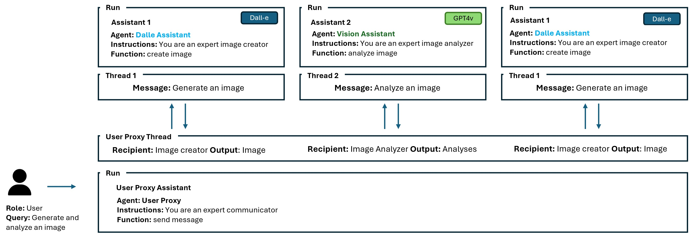

## Building a multimodal multi-agent framework with Azure Assistant API 

### Overview

This repo will walk you through the pattern of creating a multi-agent system using the Azure OpenAI Assistant API. 



Figure 1 – Multi-Agent Architecture Example

#### Introduction: What are Agents? 
Intelligent agents, are autonomous entities capable of perceiving their environment and taking action to achieve specific goals, with LLM-based agents being a subset that leverage Large Language Models (LLMs) for decision-making. Agents are important for their ability to make decisions and perform tasks independently across various environments, which is critical in fields such as robotics, gaming, and autonomous driving. LLM-based agents, in particular, combine the cognitive and strategic capabilities of LLMs with the autonomous action-taking of agents, allowing them to excel in natural language tasks and adapt to new challenges through advanced learning methods. Multi-agent systems (MAS) involve multiple such agents interacting and collaborating, which can be especially beneficial for complex tasks that span multiple domains, necessitating sophisticated coordination and specialized expertise among the agents involved.

#### Why do Agents matter in the context of the current generative AI revolution
In the realm of artificial intelligence, agents stand as the cornerstone of innovation, autonomously navigating through data, making decisions, and executing tasks that were once exclusively human domains. As we delve into the intricacies of intelligent agents, the emphasis on their autonomous learning and adaptability in various environments becomes evident. These agents, particularly those harnessing the power of large language models (LLMs), are pivotal in advancing AI to unprecedented levels of sophistication.

The importance of agents in AI cannot be overstated. They are the harbingers of a future where AI systems can interact with, learn from, and adapt to their environments, leading to more personalized and efficient solutions across industries. However, the complexity of creating such intelligent systems has been a significant barrier to their widespread adoption.

#### Moving from Single-Agents to Multi-Agent Systems
Imagine a multi-agent system where each agent is not only equipped with the ability to learn and adapt but also to communicate with other agents persistently and access a vast array of resources without the constraints of context windows. With the Azure Assistant API, developers can create multi-agent systems that are persistent and infinitely long, and append messages as users interact, all while the Assistant accesses files and tools in parallel, including a Code Interpreter and function calling capabilities.

In this blog post as we explore the transformative possibilities of building a multi-agent framework with the Azure Assistant API, a leap forward in making AI more accessible, customizable, and effective for developers and organizations alike. Whether you're an experienced developer or just starting, the Azure Assistant API is a tool that promises to revolutionize the way we think about and implement intelligent agents in our systems. 
The guide below will walk you through the pattern of creating a multi-agent system using the Azure OpenAI Assistant API. 

### Objective

In the forthcoming sections of this blog post, we will delve into the architectural blueprint of constructing a robust multi-agent system utilizing the Azure OpenAI Assistant API. Our focus will be on the patterns that serve as the foundation for these intricate frameworks, rather than providing exhaustive code samples. By dissecting these patterns, we aim to equip you with a comprehensive understanding of the principles and strategies essential for orchestrating multiple agents into a cohesive and dynamic system.

#### Multi-Agent Architecture
Figure 1 above serves as an example to demonstrate the overall architectural blueprint. In this example, the User Proxy Assistant serves as the main orchestrator between the Dalle Assistant and the Vision Assistant. 
The User Proxy Assistant has a function to send messages across agents to streamline the dialogue between the user and specialized agents within the group chat and maintain ongoing communication with them to guarantee the user's task is carried out to completion.
The Dalle Assistant has a function to generate images that calls the Dall-e model to generate an image. 
The Vision Assistant has a function to analyze images that calls the GPT-4 Vision model to analyze an image.


Figure 2 – Proxy, Dalle and Vision Assistants

The three assistants are initialized as follows:

```python
user_proxy = assistant_client.beta.assistants.create(
  name=name_pa,
  instructions=instructions_pa,
  model=assistant_deployment_name,
  tools=tools
)

dalle_assistant = assistant_client.beta.assistants.create(
  name=name_dl,
  instructions=instructions_dl,
  model=assistant_deployment_name,
  tools=tools
)

vision_assistant = assistant_client.beta.assistants.create(
    name=name_vs,
    instructions=instructions_vs,
    model=assistant_deployment_name,
    tools=tools
)
```

You can find the definition and functions of these agents in the sample notebook provided in the repository.

#### The User Proxy Agent


Figure 3 – Proxy Agent Thread

We begin by creating the User Proxy Assistant thread as follows:

```python
thread = assistant_client.beta.threads.create()
```

User Proxy Assistant thread serves as the main thread that will be used to exchange messages between agents to accomplish the users query, as demonstrated in Figure 3. 

The only input required is the user’s query to accomplish the overall task between assistants. The user ‘s query is sent to the Proxy User Assistant thread through the dispatch_message which is described in details below.

```python
user_message = input("User Query: ")

message = dispatch_message(user_message, user_proxy, thread)
```

The User Proxy Assistant has a function to send a message to appropriate agents to accomplish the task. The send message function uses the agents_threads structure to keep track of the agents and their threads, through out the entire conversation. 

```python
agents_threads: Dict[str, Dict[str, Optional[str]]] = {
    "dalle_assistant": {"agent": dalle_assistant, "thread": None},
    "vision_assistant": {"agent": vision_assistant, "thread": None},
}
```
If a thread has not been created between the User Proxy Assistant and the other agents, it creates one to initiate the conversation.

```python
# Create a new thread if user proxy and agent thread does not exist
if not recipient_info["thread"]:
    thread_object = assistant_client.beta.threads.create()
    recipient_info["thread"] = thread_object
```

For example, if the User Proxy Assistant needs to call the Dalle Assistant it creates a new thread between both agents as shown in Figure 4. 


Figure 4 – User Proxy and Dall-e Assistant communication 

The send message function calls another function to create and dispatch a message to the appropriate agent to execute the task. 

```python
message = dispatch_message(query, recipient_info["agent"]
```

The dispatch_message function scans and discovers all available functions for that specific assistant and by using the agent.tool function and adds it to it’s available function dictionary.

```python
available_functions = {}  
      
 # Iterate through each tool in the agent.tools list  
    for tool in agent.tools:  
        # Check if the tool has a 'function' attribute  
        if hasattr(tool, 'function'):  
            function_name = tool.function.name  
        # Attempt to retrieve the function by its name and add it to the 
        available functions dictionary                        
            if function_name in globals():  
                available_functions[function_name] = globals()[function_name]  
        else:  
            # Handle the case where the tool does not have a 'function' 
            attribute 
            print("This tool does not have a 'function' attribute.")  
```

The dispatch_message function then sends a message to the appropriate assistant to execute the task at hand by creating a new message to the thread and executing the assistant’s create function. (The same is used for the user query to the Proxy User Assistant thread)

```python
# Draft a new message as part of the ongoing conversation.
message = assistant_client.beta.threads.messages.create(thread_id=thread.id, role="user", content=message)
    # Carry out the tasks delineated in this discussion thread.
    run = assistant_client.beta.threads.runs.create(
        thread_id=thread.id,
        assistant_id=agent.id,
    )
```

The assistants thread run functions evaluates the necessity of a tool or function for the task at hand. Upon determining the requirement, it assigns the appropriate function to the assistant for invocation. Once called, the function executes and delivers its output to the tool_response object.

```python
# Execute the proper function to execute the task if an action is required
      if run.status == "requires_action":
        tool_calls = run.required_action.submit_tool_outputs.tool_calls
        tool_outputs = []
        for tool_call in tool_calls:
          tool_responses = []
          if (
              run.required_action.type == "submit_tool_outputs"
              and run.required_action.submit_tool_outputs.tool_calls is not None
          ):
              tool_calls = run.required_action.submit_tool_outputs.tool_calls

              for call in tool_calls:
if call.type == "function":
   if call.function.name not in available_functions:
      raise Exception("Function requested by the model does not exist")
      #associate the proper function to the agent to call
        function_to_call = available_functions[call.function.name]
        tool_response = function_to_call(**json.loads(call.function.arguments))
        tool_responses.append({"tool_call_id": call.id, "output": tool_response})

 # submit tool outputs
        run = client.beta.threads.runs.submit_tool_outputs(
            thread_id=thread.id,
            run_id=run.id,
            tool_outputs=tool_responses
        )
```

The output is the message back to proxy agent through the submit_tool_outputs.

For example, as demonstrated in Figure 5, the Dall-e Assistant sends back the created image to the User Proxy Assistant thread.


Figure 5 – The message and output between assistants

#### Multi-Agent Process
The Proxy User Assistant then needs to call the Vision Assistant to analyze the image and provide feedback. The Proxy User Assistant repeats the same process as above but this time it calls the Vision Assistant, thus generating a new thread to the existing Proxy User Thread. This step can be repeated over and over again until the task is completed as shown in Figure 1. 


Figure 1 – Multi-Agent Architecture Example

#### Optional - Plan
To enhance the predictability of the workflow, we have integrated a structured plan into the User Proxy Assistant's instruction. This plan will serve as a roadmap for the assistant, ensuring that it adheres to a specified sequence of actions for each image it processes. Implementing this plan is not mandatory; you may prefer to allow your agents the flexibility to operate in a more stochastic and adaptive manner.


```python
Plan:
1. dalle_assistant creates and sends the image to the user_proxy agent
2. vision_assistant analyzes images and sends the prompt to the user_proxy agent.
3. dalle_assistant creates and sends the image to the user_proxy agent.
4. vision_assistant analyzes images and sends the prompt to the user_proxy agent.
5. dalle_assistant creates and sends the image to the user_proxy agent.
```

### Conclusion:
The exploration of a multi-agent framework using the Azure Assistant API has provided us with a glimpse into the future of AI interaction and collaboration. By leveraging the power of LLM-based agents within the Azure ecosystem, we have seen how creating a network of specialized agents can lead to more dynamic and intelligent systems capable of complex tasks and decision-making processes.

Through the process of initializing assistants, creating threads, dispatching messages, and running functions, we've outlined a robust pattern for developers to follow. This pattern not only simplifies the complexity inherent in multi-agent systems but also scales the capabilities of each agent to interact with one another to achieve overarching goals.

Please find the comprehensive Jupyter notebook, ready for your experimentation and exploration. Keep an eye out for an update on Agent Swarms!

Please see attached notebook for output example.

### Programming Languages
 - Python, Jupyter Notebook

### Estimated Runtime: 5-10 mins

## Example Output

Dalle Assistant Message: Creating the image ...


Vision Assistant Message: Analyzing the image...
Vision Assistant Message: This image portrays a bustling, vibrant metropolis set in a futuristic or outer-space environment. The color palette is particularly rich, with purples and blues providing an otherworldly atmosphere that's both inviting and intriguing. A mix of organic and geometric shapes gives the cityscape an eclectic architectural style, accompanied by hovering spacecraft and distant planets that solidify the sci-fi setting.

The foreground exhibits a diverse array of beings, suggesting a cosmopolitan community where various species coexist. The urban landscape is reflected beautifully on the water's surface, enhancing the sense of depth and scale. Moreover, the use of light and shadow is well-executed, creating a dynamic contrast that draws the eye to different parts of the image.

However, the artwork could be criticized for potentially overwhelming detail, which could be streamlined for more focus and impact. The composition might benefit from a more distinct focal point to guide the viewer's attention. Also, the city's elements seem uniformly distributed across the space, which might lead to a lack of hierarchy within the visual narrative.

Considering the criticism and analysis, here is an enhanced prompt for Dall-e:

"Create an image of a futuristic cityscape at twilight, focusing on a central towering spire that is the main focal point. Use a color palette dominated by shades of purples and blues with strategic lighting to highlight architectural features. Include diverse sentient beings coexisting harmoniously in the foreground, but ensure the detail doesn't overwhelm the composition. Reflect the cityscape in the calm surface of a body of water to add depth, and include a few strategically placed spacecraft within the sky to enhance the sci-fi atmosphere."

Dalle Assistant Message: Creating the image ...


 
Vision Assistant Message: Analyzing the image...

Vision Assistant Message: This image depicts a futuristic city with a striking central tower surrounded by other tall spires, all illuminated against a twilight sky and a stunning cosmic backdrop. The use of light and color in the image is impressive, giving a sense of depth and grandeur to the scene. The reflections on the water and the detailed lighting of the cityscape add to the overall visual impact.

However, the image could benefit from a clearer sense of scale and perspective. The central tower, while impressive, appears somewhat isolated without any visible activity or context to anchor its significance within the city. Additionally, the shooting stars in the sky, though visually appealing, seem random and could be better integrated into the composition.

Enhanced Prompt for Dall-e:
"Create an image of a futuristic city during twilight, with a central tower that is not only the tallest and most radiant structure but also bustling with activity. Include visible transportation systems, such as flying cars or public transit, connecting the tower to the rest of the city. Integrate the cosmic backdrop more cohesively by having the shooting stars interact with the city's energy grid or serve as a source of power for the city. Emphasize the sense of scale by showing people or recognizable objects in the foreground for comparison."
Dalle Assistant Message: Creating the image ...


