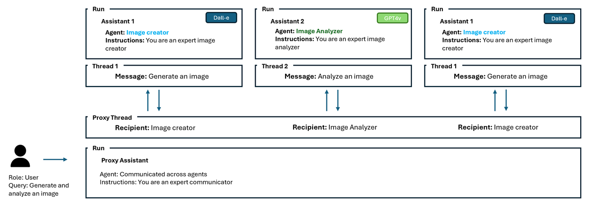

# Azure OpenAI Multi-Agent Assistant API
This repo will walk you through the pattern of creating a multi-agent system using the Azure OpenAI Assistant API. 

In the realm of artificial intelligence, agents stand as the cornerstone of innovation, autonomously navigating through data, making decisions, and executing tasks that were once exclusively human domains. As we delve into the intricacies of intelligent agents, the emphasis on their autonomous learning and adaptability in various environments becomes evident. These agents, particularly those harnessing the power of large language models (LLMs), are pivotal in advancing AI to unprecedented levels of sophistication.

The importance of agents in AI cannot be overstated. They are the harbingers of a future where AI systems can interact with, learn from, and adapt to their environments, leading to more personalized and efficient solutions across industries. However, the complexity of creating such intelligent systems has been a significant barrier to their widespread adoption.

Imagine a multi-agent system where each agent is not only equipped with the ability to learn and adapt but also to communicate with other agents persistently and access a vast array of resources without the constraints of context windows. With the Azure Assistant API, developers can create multi-agent systems that are persistent and infinitely long, and append messages as users and agents interact, all while the Assistants accesses files and tools in parallel, including a Code Interpreter and function calling capabilities.

In this blog post as we explore the transformative possibilities of building a multi-agent framework with the Azure Assistant API, a leap forward in making AI more accessible, customizable, and effective for developers and organizations alike. Whether you're an experienced developer or just starting, the Azure Assistant API is a tool that promises to revolutionize the way we think about and implement intelligent agents in our systems.  

In the forthcoming sections of this blog post, we will delve into the architectural blueprint of constructing a robust multi-agent system utilizing the Azure OpenAI Assistant API. Our focus will be on the patterns that serve as the foundation for these intricate frameworks, rather than providing exhaustive code samples. By dissecting these patterns, we aim to equip you with a comprehensive understanding of the principles and strategies essential for orchestrating multiple agents into a cohesive and dynamic system.
The diagram above serves as an example to demonstrate the overall architectural blueprint. In this example, the Proxy Agent serves as the main orchestrator between the Image Creator Assistant and the Vision Analyzer Assistant. The proxy agent’s function is to send messages across agents to streamline the dialogue between the user and specialized agents within the group chat and maintain ongoing communication with them to guarantee the user's task is carried out to completion.

We define the three agents as follows:

<pre lang=lisp>
  dalle_assistant = client.beta.assistants.create(
    name=name_dl,
    instructions=instructions_dl,
    model=api_deployment_name,
    tools=tools
)
</pre>
<pre lang=lisp>
  vision_assistant = client.beta.assistants.create(
    name=name_vs,
    instructions=instructions_vs,
    model=api_deployment_name,
    tools=tools
)
</pre>
<pre lang=lisp>
  user_proxy = client.beta.assistants.create(
    name=name_pa,
    instructions=instructions_pa,
    model=api_deployment_name,
    tools=tools
)
</pre>

The dalle_assistant agent has a function to generate images and the vision_assistant has a function to analyze images. You can find the definition and functions of these agents in the sample code provided below.

The proxy_agent has a function to send a message to appropriate agents to accomplish the task. The send message function uses the agents_threads structure to keep track of the agents and their threads, through out the entire conversation. If a thread has not been created between the proxy agent and the other agents, it creates one to initiate the conversation.

<pre lang=lisp>
  agents_threads: Dict[str, Dict[str, Optional[str]]] = {  
    "dalle_assistant": {  
        "agent": dalle_assistant, 
        "thread": None
    },
    "vision_assistant": {  
        "agent": vision_assistant, 
        "thread": None
    } 
}  
</pre>

The send message function calls another function to dispatch the message to the appropriate agent and it’s thread.

<pre lang=lisp>
message = dispatch_message(query, recipient_info["agent"], recipient_info["thread"]) 
</pre>

The dispatch_message function identifies the available functions to use for that specific agent by using the agent.tool function.

<pre lang=lisp>
available_functions = {}  
      
    # Iterate through each tool in the agent.tools list  
    for tool in agent.tools:  
        # Check if the tool has a 'function' attribute  
        if hasattr(tool, 'function'):  
            function_name = tool.function.name  
            # Attempt to retrieve the function by its name and add it to the available_functions dictionary  
            if function_name in globals():  
                available_functions[function_name] = globals()[function_name]  
        else:  
            # Handle the case where the tool does not have a 'function' attribute  
            print("This tool does not have a 'function' attribute.")  
</pre>

A message is created for that specific agent to execute the task at hand. 

<pre lang=lisp>
 message = client.beta.threads.messages.create(
        thread_id=thread.id,
        role="user",
        content=message
    ) 
</pre>

The dispatch_message execute the thread with the appropriate message and executes the proper function to be executed by the agent.

<pre lang=lisp>
 run = client.beta.threads.runs.create(
      thread_id=thread.id,
      assistant_id=agent.id,
    )
</pre>

<pre lang=lisp>
# Execute the proper function to execute the task if an action is required
      if run.status == "requires_action":
        tool_calls = run.required_action.submit_tool_outputs.tool_calls
        tool_outputs = []
        for tool_call in tool_calls:
          tool_responses = []
          if (
              run.required_action.type == "submit_tool_outputs"
              and run.required_action.submit_tool_outputs.tool_calls is not None
          ):
              tool_calls = run.required_action.submit_tool_outputs.tool_calls

              for call in tool_calls:
                        if call.type == "function":
                            if call.function.name not in available_functions:
                                raise Exception("Function requested by the model does not exist")
                            
                            #associate the proper function to the agent to call
                            function_to_call = available_functions[call.function.name]
                            tool_response = function_to_call(**json.loads(call.function.arguments))
                            tool_responses.append({"tool_call_id": call.id, "output": tool_response})
</pre>

<pre lang=lisp>
  run = client.beta.threads.runs.submit_tool_outputs(
        thread_id=thread.id,
        run_id=run.id,
        tool_outputs=tool_responses
      )
</pre>

The output is the message back to proxy agent. In this case it could be an image generated by the Dalle Assistant or an image analyzes generated by the Vision Assistant.
This process continues until the proxy agent has been able to complete the entire process. 

Please see attached notebook for output example.
